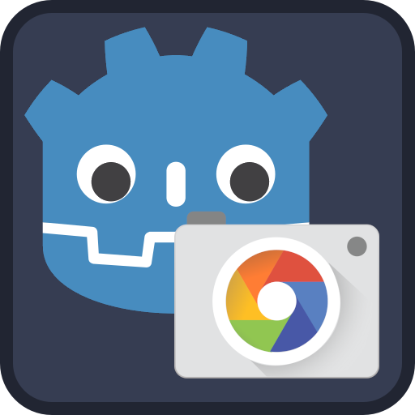

# Godot Android Camera Demo

Demo for Godot 4.2 on how to obtain photographs from the camera on Android using the GetImage plugin and how to use them as a texture within a material.

## Godot GetImage Plugin

This demo uses the GetImage plugin:

[https://github.com/Lamelynx/GodotGetImagePlugin-Android](https://github.com/Lamelynx/GodotGetImagePlugin-Android)

## Links

Godot Tutorials (in spanish):  
Tutoriales de Godot (en español):    
[Todogodot](https://youtube.com/@todogodot) [https://youtube.com/@todogodot](https://youtube.com/@todogodot)

Twitch Live Streaming (in spanish):  
Directos en Twitch (en español):  
[https://twitch.tv/rafalagoon](https://twitch.tv/rafalagoon)

Todogodot Telegram Group (in spanish):  
Grupo de Telegram de Todogodot (en español):  
[https://t.me/@todogodot](https://t.me/@todogodot)

